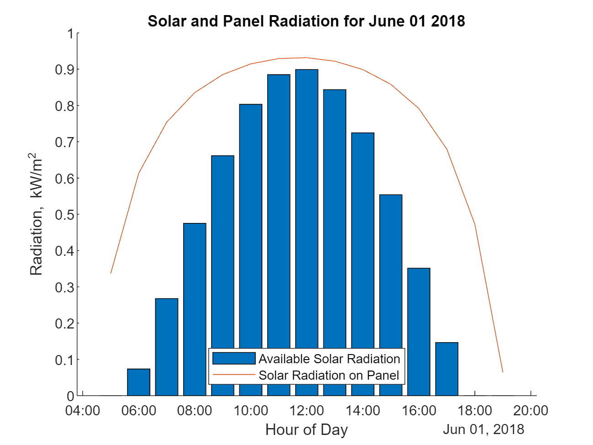
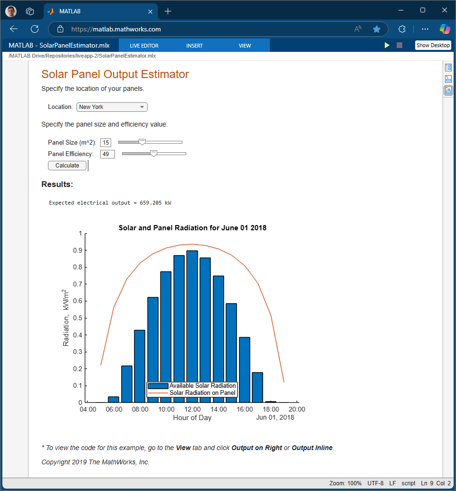

# Solar Panel Output Estimator 

## Resources:
* [https://www.youtube.com/watch?v=jmgnToYS72o&ab_channel=MATLAB](https://www.youtube.com/watch?v=jmgnToYS72o&ab_channel=MATLAB)
* [Focused View for MATLAB Apps and Live Scripts](https://www.mathworks.com/products/matlab-online/focused-view.html)
* [Create an Interactive Form Using the Live Editor](https://www.mathworks.com/help/matlab/matlab_prog/live-editor-to-create-interactive-form.html)
* [How to Turn Your Script into a Simple App](https://github.com/mathworks/how-to-turn-your-script-into-a-simple-app)

## Results: 

<!-- 

 -->

 ** To view the code for this example, go to the* ***View*** *tab and click* ***Output on Right*** *or* ***Output Inline****.*

*Copyright 2019-2024 The MathWorks, Inc.*

